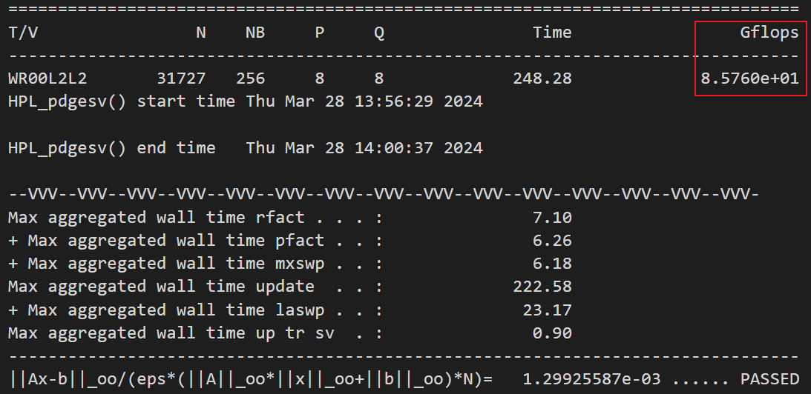

# Benchmark_test - HPL

## Introduction


HPL (High-Performance Linpack) is a software package for solving stochastic dense linear systems with double-precision algorithms on distributed memory computers. Simulate computationally intensive tasks found in real-world scientific and engineering calculations by performing highly parallelized matrix multiplication and matrix-vector multiplication operations.


```bash
# 1. Download
wget http://www.netlib.org/benchmark/hpl/hpl-2.3.tar.gz
# 2. Unzip
tar -xzf hpl-2.3.tar.gz
# 3. cd&cp
cd hpl-2.3 ; cp setup/Make.Linux_Intel64 Make.test 
# 4.Setup profile （设置配置文件中正确的环境路径）
vim Make.test ; arch = test 
# 5. Compile
make arch = test
# 6. run_test
cd bin/test ； ./xhpl
```


### Adjustment parameters

HPL.dat is the input file in the HPL benchmark and is used to specify the parameters and configuration of the test. The size of the matrix used in the test, the size of the blocks, the number of parallel processes and other relevant parameters are defined.

Optimize the parameters in HPL.dat to test and obtain the peak operating value of the cluster

In HPL.dat, mainly focus on 3 parameters: NB, N, P×Q

- NB - represents the block size

The block size of NB is the calculation granularity. Note that NB×8 must be a multiple of Cache Line, which is generally less than 256. 

According to test experience, the choice of NB size is also related to communication, matrix size, network, and processor speed. When NB is too small, the communication volume is greater than the optimization calculation volume, resulting in a sharp drop in speed; when it is too large, load balancing will be affected.

Use cat /proc/cpuinfo to obtain the cache line of the CPU, set NB×8 as a multiple of the Cache Line, and conduct multiple sets of tests.

- P x Q  - 2D processing grid

P: Number of lines of parallel processes. Indicates the number of rows in the processor grid to be used

Q: Number of columns for parallel processes. Indicates the number of columns of the processor grid to be used

The maximum value of P × Q is the number of CPU environment processes

General selection: P <= Q

P × Q= the number of CPUs = the number of processes

```sh
# Check the number of CPU cores and processes
cat /proc/cpuinfo | grep cores     
cat /proc/cpuinfo | grep processor
```
- N - matrix size 

The larger the size of the matrix N, the greater the proportion of effective calculations, and the higher the efficiency of the system's floating point processing. But at the same time, the increase of matrix N will lead to an increase in memory consumption. Once the system has very little actual memory space, available cache and performance are significantly reduced.

Theoretical optimal value: N occupies about 80% of the total system memory, that is, N × N × 8 = total system memory × 80%

### Run & Result

After setting the parameters, you can run HPL to test the performance of the machine.

```sh
# num is the number of processes
mpirun -np <num> ./xhpl

```

Output：



The main test indicator of HPL is the peak performance of floating point operations (FLOPs) performed per second (shown in the red box in the figure above)

Other parameter explanations:

```test
T/V: Test Pattern and Accuracy
N : the size of the problem or the dimensions of the matrix
NB: block size
P: Number of lines of parallel processes
Q: Number of columns for parallel processes
Time: The time required to complete the test
Gflops: The peak performance of the test, that is, the number of floating point operations per second (GFLOPS)
```

## Using script

In order to easily obtain the theoretical merit of the HPL.dat parameters, you can easily use a script to complete it.

Before using scirpt, python environment dependencies need to be installed.

```sh
pip install py-cpuinfo
pip install tqdm
pip install psutil
# pip install py-json
```

```sh
# Using scirpt
sh run.sh
```

After that, the output of HPL will show in `output` floder

And if you want to conduct multiple consecutive sets of tests, you can add it directly to the `./output/script.txt` file (add the format as `N NB P Q`)